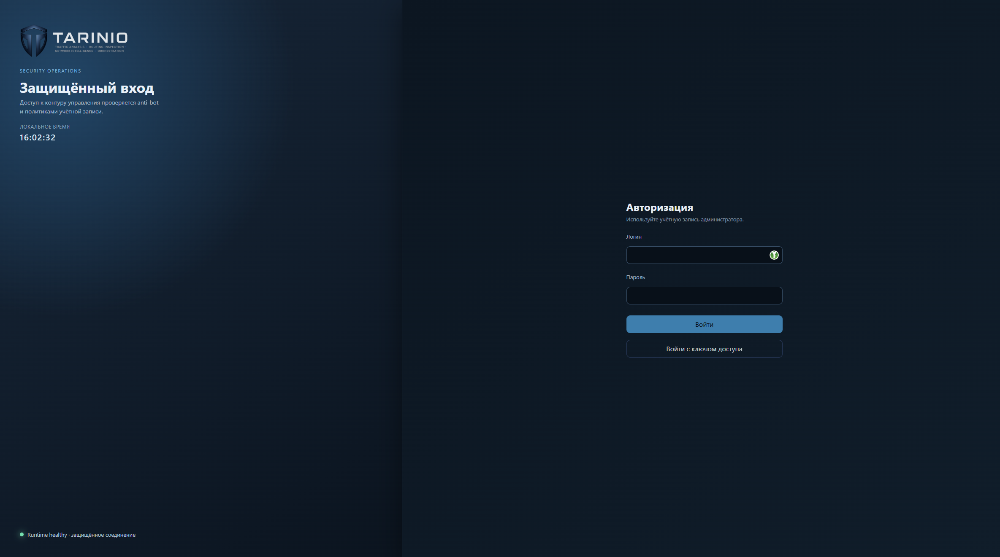
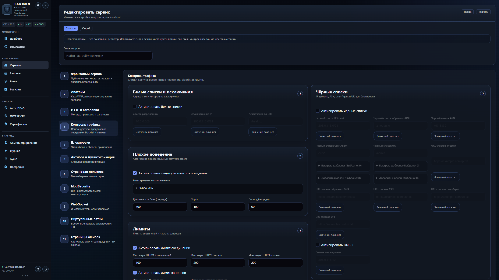
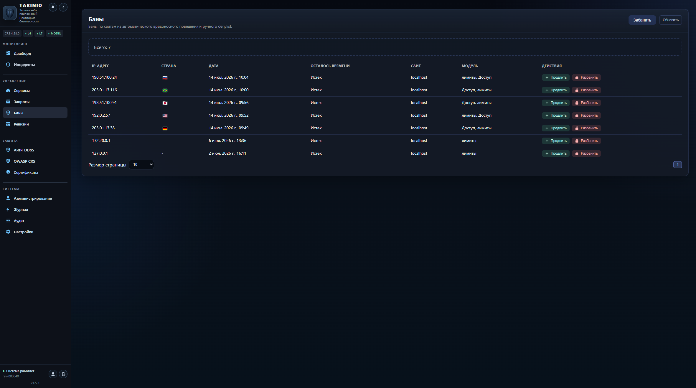

# Berkut Solutions - TARINIO

  

[English version](README.en.md)

Berkut Solutions - TARINIO - self-hosted платформа защиты и управления веб-трафиком (WAF/CRS + L4/L7 Anti-DDoS) с централизованным управлением изменениями через ревизии.

Актуальная версия: `1.1.12`

## Что это

TARINIO принимает входящий трафик перед бизнес-приложениями, проверяет запросы правилами безопасности, применяет rate-limit и Anti-DDoS политики и выкатывает изменения через контролируемый цикл ревизий:

- `compile` -> `validate` -> `apply`
- rollback на последнюю стабильную ревизию при рисках

Это дает воспроизводимые изменения, аудируемые операции и единый контур управления для runtime и control-plane.

## Для кого

- Команды, которым нужен self-hosted WAF-периметр без внешнего SaaS.
- Инфраструктурные и security-команды, которым нужен контролируемый rollout политик.
- Организации, где важны трассируемость изменений и предсказуемое восстановление после инцидентов.

## Ценность

- Снижение риска инцидентов за счет фильтрации нежелательного трафика до приложений.
- Контролируемый выпуск конфигурации через ревизии и единый audit trail.
- Единый контур управления WAF, TLS, доступом, rate-limit и Anti-DDoS.

## Возможности

- WAF/CRS инспекция запросов и enforcement политик доступа.
- L4/L7 Anti-DDoS с глобальными и per-site настройками.
- Управление сайтами, upstream, сертификатами и TLS-конфигурациями.
- События, request logs, аудит и отчеты по ревизиям.
- UI + API + CLI (`waf-cli`) для операторских сценариев.

## Безопасность

- Server-side zero-trust проверки на каждом endpoint.
- Session auth с поддержкой 2FA (TOTP) и passkeys (WebAuthn).
- Self-hosted контур данных для runtime и control-plane.
- Production baseline: недефолтные секреты, HTTPS, ограниченные trusted proxies.

## Технический стек

- Backend: Go.
- Runtime: NGINX + ModSecurity + OWASP CRS.
- Storage: PostgreSQL.
- Deployment: Docker / Docker Compose.

## Документация

- Индекс: [`docs/README.md`](docs/README.md)
- Русская документация: [`docs/ru/README.md`](docs/ru/README.md)
- English documentation: [`docs/eng/README.md`](docs/eng/README.md)
- Команды CLI: [`docs/CLI_COMMANDS.md`](docs/CLI_COMMANDS.md)

## Быстрый старт

- AIO one-command установка:
  - `curl -fsSL https://raw.githubusercontent.com/BerkutSolutions/tarinio/main/scripts/install-aio.sh | sh`
- Docker image:
  - `docker pull ghcr.io/berkutsolutions/tarinio:latest`
- Deploy: [`docs/ru/deploy.md`](docs/ru/deploy.md)
- Runbook: [`docs/ru/runbook.md`](docs/ru/runbook.md)
- Обновление/откат: [`docs/ru/upgrade.md`](docs/ru/upgrade.md)
- Compose профили: [`deploy/compose/README.md`](deploy/compose/README.md)

## Интерфейс

